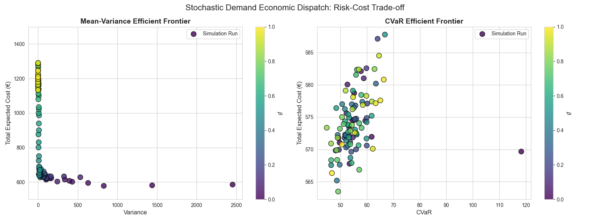
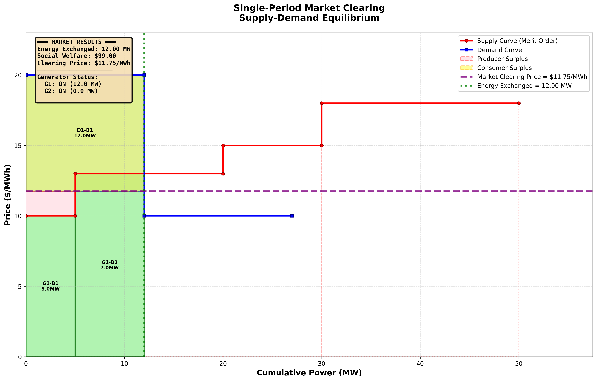

# MESIO-Optimization-Electricity-Systems-Markets
The following repository contains my solutions to the weeky assigments for the Optimization in Energy Systems and Markets course @ MESIO Fall 2025. 
The implementation of the optimization models is typically done in the Algebraic Modeling Languages AMPL and Pyomo.

## Installation
In order to run AMPL-based modes you need a valid license and `ampl` available in your PATH. To run the Pyomo implementations, simply build a Python virtual enviroment with the available `pyproject.toml`.

## Example Gallery:
1. **Efficient Frontier for Mean-Variance and CVaR risk measures in Stochastic Demand Economic Dispatch problem (SDED)**
   
    
    NOTE: Data is simulated for each value of $\beta \in [0,1]$.

2. **(Simple) Single-Period Market Clearing**
    
    

